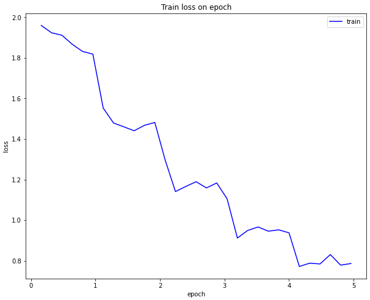
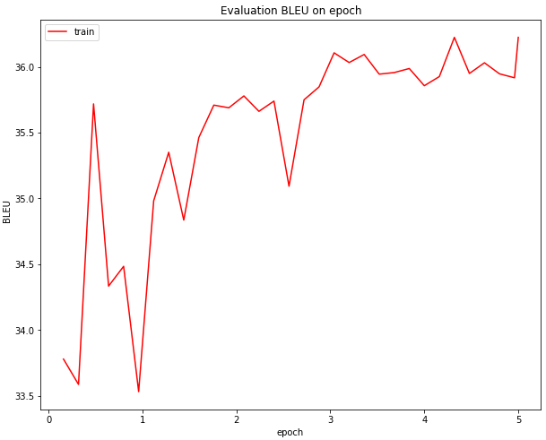
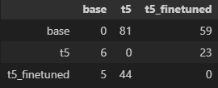

# Pet-проект "Угадай мультфильм по эмодзи".
Основная идея данного проекта заключалась в рассмотрении возможных способов конвертации текста (используя ML) в эмодзи с дальнейшим применением их на практике.

**Используемые языки:**
* Python


## Project structure:
    .
    ├── data                        # папка под данные, необходимые для/полученные при работе
    │   ├── MultiSim_ru             # папка с собранным датасетом для обучения суммаризационной модели
    │   │   └── ...
    │   ├── emojis.json             # файл, содержащий список с эмодзи и соответствующие им вектора, полученные с помощью Embedding модели
    │   ├── movies_base.json        # изначальный файл с собранными данными о мультфильмах
    │   ├── movies_*var*.json       # файл, собранный с применением var (t5 — суммаризованный моделью t5, t5_finetuned — суммаризованный дообученной моделью...)
    │   ├── movies_*var*_emoj.json  # файл, содержащий эмодзи представление описания
    │   └── ...                     
    ├── models                      # общая папка под модели
    │   ├── summarization           # папка под модели для суммаризации текста
    │   └── convertation            # папка под модели, что нужны при конвертации текста в эмодзи
    │       ├── navec               # папка под navec векторизатор
    │       │   └── ... 
    │       └── torchmoji           # папка под TorchMoji модель
    │           └── ... 
    ├── scripts                     # папка под скрипты
    │   ├── train.py                # файл со скриптом обучения модели
    │   ├── convertation.py         # файл для конвертации датасета (описания мультфильмов) в эмодзи
    │   ├── convertation_emojis.py  # файл для конвертации эмодзи в вектора (создания './data/emojis.json')
    │   ├── summarization.py        # файл для суммаризации собранных датасетов
    │   ├── inference.py            # файл, аналогичный summarization.py, но для определённой строки (TEXT_TO_SUMMARIZE), а не всего датасета
    │   ├── run_bot.py              # файл для запуска бота
    │   ├── utils.py                # файл для вспомогательных функций
    │   └── settings.py             # файл для различных настроек других скриптов
    ├── images                      # папка под картинки
    │   └── ... 
    ├── task.ipynb                  # файл с подробным описанием применённых методик
    ├── chromedriver.exe            # драйвер для браузера, необходим при парсинге html страниц
    ├── README.md                   # файл, содержащий основную информацию о проекте
    ├── requirements.txt            # файл со списком необходимых библиотек для работы проекта
    ├── .env                        # файл, содержащий особые переменные окружения (токен для бота)
    └── .gitignore                  # файл, описывающий что git должен игнорировать в репозитории


## Requirements:
Файл `requirements.txt` содержит необходимые библиотеки Python для запуска вложенных файлов.

Они могут быть установлены следующей командой:
```
pip install --user -r requirements.txt
```


## Setup:
Файл `task.ipynb` содержит описание рассматриваемых вариантов и пояснение выполняемых действий, в то время как `./scripts/*.py` файлы содержат меньше объяснений, но являются более обобщающими (комбинируют в себе работу с нескольких шагов).

Все файлы из папки `./scripts` могут быть запущены простой командой (настройки для них определены в `./scripts/settings.py`):
```
python ./scripts/*.py
```


## Training:
Настройки для обучения описаны в файле `./scripts/settings.py`, блок "настройки для обучения".

Для обучения суммаризационной модели:
```
python ./scripts/train.py
```


## Inference:
Настройки для инференса описаны в файле `./scripts/settings.py`, блок "настройки для инференса суммаризационной модели".

Для запуска суммаризационной модели:
* На датасете:
```
python ./scripts/summarization.py
```
* На одном предложении:
```
python ./scripts/inference.py
```


## Results:
**1) С помощью веб-скрапинга был собран корпус с данными о мультфильмах (`./data/movies_base.json`).**

**2) Модель с Hugging Face была дообучена на русскоязычной части датасета [MultiSim](https://huggingface.co/datasets/MichaelR207/MultiSim).**

Метрики получились следующие:





Результаты обучения:

    — Модель перестала работать в контексте газетных статей (был проведён domain shift).
    — Слегка увеличилась метрика BLEU, отражающая качество совпадения предсказания (суммаризации) с ожиданием.

**3) Проанализированы варианты конвертации текста в эмодзи.**

Оптимальным стал подход с приведением слов к лемме, векторизации и последующим подсчётом косинусной близости с векторами эмодзи. Далее отчёт будет идти про него.

Количество сконвертированных описаний в эмодзи (≥2 эмодзи для мультфильма) при использовании различных вариантов обработки (суммаризации) описания:

    — Число мультфильмов в датасете 'base': 211
    — Число мультфильмов в датасете 't5': 136
    — Число мультфильмов в датасете 't5_finetuned': 157
  
Кроме того, между обработками различается ещё и число эмодзи в представлении. 

    — Среднее число эмодзи при описании 'base': 4.6635071090047395
    — Среднее число эмодзи при описании 't5': 2.889705882352941
    — Среднее число эмодзи при описании 't5_finetuned': 3.210191082802548

Обобщив:

    — Без суммаризации сконвертироваться в эмодзи смогли 211 из 250 описаний мультфильмов.
    — При использовании "готовой" модели много (114!) мультфильмов (на 75 больше, чем без суммаризации) не смогли сконвертироваться в хотя бы 2 эмодзи.
    — У дообученной модели сконвертироваться в эмодзи не смогли лишь 93 фильма, что всё ещё уступает конвертации без суммаризации на 54.
    — Больше всего эмодзи на описание приходится при отсутствии суммаризации (~4.7),  за ним — дообученная t5 модель (~3.2) и хуже всего — обычный t5 (~2.9).

Сравнение числа уникальных мультфильмов в датасетах, полученных различными способами:



Можно заметить, что модели всё же смогли сконвертировать описание некоторых мультфильмов, которые оказались не под силу при обработке без суммаризации.
И ещё учитывая небольшое количество эмодзи, в целом, после любого варианта обработки описания, было решено соединить все датасеты в один `./data/movies_comb_emoj.json` и использовать его в телеграм боте.

**4) Создан [телеграм-бот](https://t.me/movie_emoji_bot) для отгадывания мультфильмов по эмодзи представлению их описания.**


## Links:
* [Данные](https://www.kinopoisk.ru/) для конвертации в эмодзи
* [Датасет](https://huggingface.co/datasets/MichaelR207/MultiSim)
* [T5 модель](https://huggingface.co/IlyaGusev/rut5_base_sum_gazeta)
* Другие [модели](https://github.com/IlyaGusev/summarus) для суммаризации русскоязычного текста
* [TorchMoji](https://github.com/huggingface/torchMoji)
* [Navec](https://github.com/natasha/navec) для векторизации слов
* [Статья](https://habr.com/ru/articles/442800/) по созданию бота
* Сам созданный [бот](https://t.me/movie_emoji_bot)